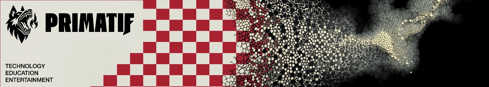

# Primatif

Primatif partners with organizations of all sizes, offering expert consulting, engineering, and strategic guidance to empower them in navigating their technological landscape with confidence and driving growth through innovation.

  

---

## Industries We Empower

* Technology
* Education
* Entertainment

---

## Our Services

* **Software Engineering:** Specializing in the full lifecycle of software creation, from R&D to deployment and modernization.
* **Technology Business and Process Management:** Align your technology investments directly with your business objectives to maximize ROI.
* **General Tech Consulting and Task Execution:** Providing versatile tech consulting and hands-on task execution to address your unique business challenges.
* **Analytics and Data Science:** Transform your raw data into a strategic asset that drives competitive advantage.
* **Generative AI Tools and Techniques:** Unlock the transformative power of Generative AI.
* **Hiring and Interviewing Assistance:** Build a high-performing technical team faster.

### 📺 Latest YouTube Videos

<!-- BEGIN YOUTUBE-CARDS -->
[ - Initializing Tauri Application with Rust, SQLite, SolidJS, GeminiCLI")](https://www.youtube.com/watch?v=rBouxS1Plfc)
[ - Initializing Tauri Application, with Rust, SQLite, SolidJS, GEMINI")](https://www.youtube.com/watch?v=iyajdHMMtkI)
<!-- END YOUTUBE-CARDS -->

[Website](https://primatif.com)
